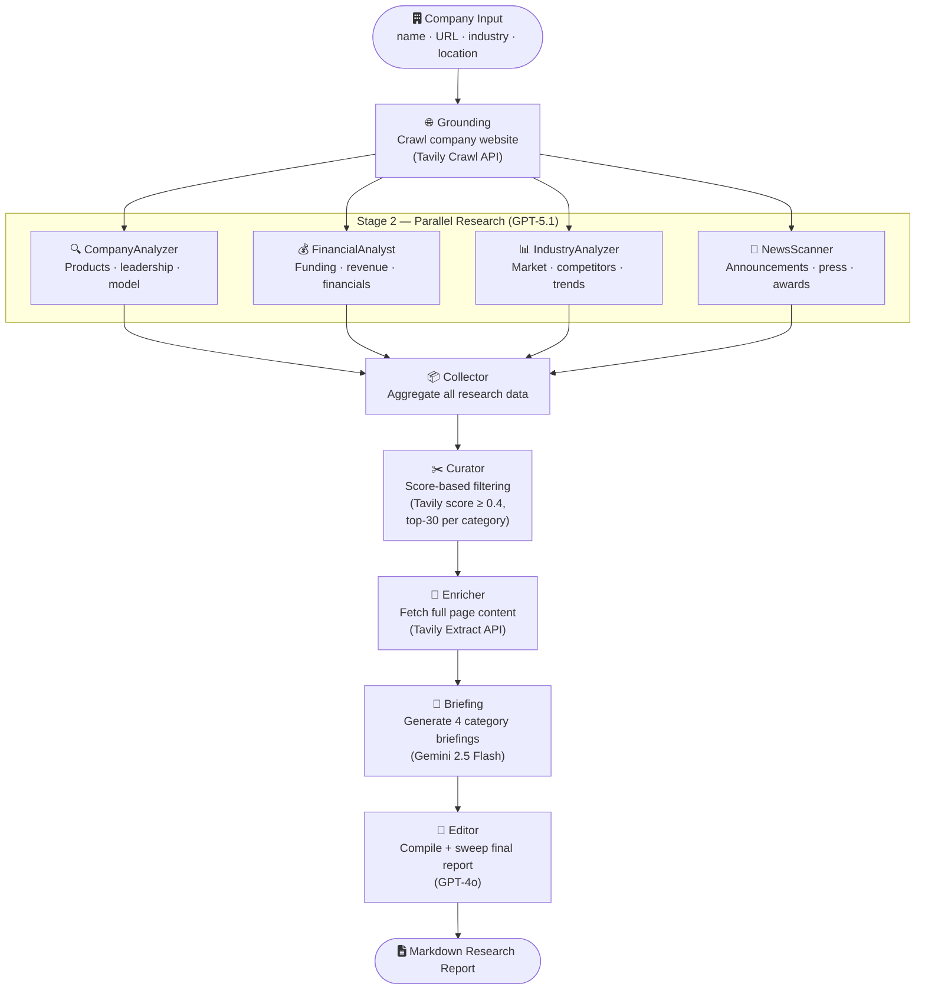

# Agent Documentation — GHCompanyResearchDemo

## Overview

This repository implements an **AI-powered multi-agent company research system**. Given a company name and optional context (website URL, industry, headquarters location), the system automatically gathers, filters, enriches, and synthesises information from the web into a polished research report in Markdown format.

The pipeline is orchestrated with [LangGraph](https://github.com/langchain-ai/langgraph). Ten specialised nodes execute in a directed graph: one grounding node fans out to four parallel research nodes, then sequential processing nodes filter, enrich, summarise, and finally compile the report.

---

## Agentic Architecture Diagram



### Data-flow summary

| Stage | Node(s) | Input | Output |
|-------|---------|-------|--------|
| 1 | Grounding | Company website URL | `site_scrape` documents |
| 2 | 4 Research agents (parallel) | Company context + Tavily Search | `*_data` document sets |
| 3 | Collector | All `*_data` fields | Validated, aggregated documents |
| 4 | Curator | Raw document sets | `curated_*_data` (filtered & ranked) |
| 5 | Enricher | Curated URLs | Documents with `raw_content` |
| 6 | Briefing | Enriched documents | 4 category briefing strings |
| 7 | Editor | 4 briefings + references | Final Markdown report |

---

## Agent / Node Reference

### 1 · Grounding Node

**File:** `backend/nodes/grounding.py`

**Purpose:** Establish initial context about the target company by crawling its website before any web search takes place.

**Tool used:**

| Tool | API call | Configuration |
|------|----------|---------------|
| Tavily Crawl | `AsyncTavilyClient.crawl()` | `max_depth=1`, `max_breadth=50`, `extract_depth="advanced"` |

**Behaviour:**
- If `company_url` is provided, crawls up to 50 pages one level deep.
- Falls back gracefully (empty `site_scrape`) when no URL is provided.
- Emits `research_init`, `crawl_start`, `crawl_success` / `crawl_error` real-time events.

**Output state key:** `site_scrape`

---

### 2a · CompanyAnalyzer

**File:** `backend/nodes/researchers/company.py`  
**Base class:** `BaseResearcher` (`backend/nodes/researchers/base.py`)

**Purpose:** Research the company's core products, services, history, leadership, and business model.

**LLM (query generation):** `gpt-5.1` via `ChatOpenAI`  
**Prompt:** `COMPANY_ANALYZER_QUERY_PROMPT`

**Tools used:**

| Tool | API call | Parameters |
|------|----------|-----------|
| Tavily Search | `AsyncTavilyClient.search()` | `search_depth="basic"`, `max_results=5` |

**Workflow:**
1. Calls GPT-5.1 to generate 4 targeted search queries.
2. Executes all 4 queries in parallel via `asyncio.gather`.
3. Deduplicates results by URL.
4. Emits `query_generating`, `query_generated`, `search_started`, `search_complete` events.

**Output state key:** `company_data`

---

### 2b · FinancialAnalyst

**File:** `backend/nodes/researchers/financial.py`  
**Base class:** `BaseResearcher`

**Purpose:** Research fundraising history, financial statements, and revenue model.

**LLM (query generation):** `gpt-5.1` via `ChatOpenAI`  
**Prompt:** `FINANCIAL_ANALYZER_QUERY_PROMPT`

**Tools used:**

| Tool | API call | Parameters |
|------|----------|-----------|
| Tavily Search (finance topic) | `AsyncTavilyClient.search()` | `search_depth="basic"`, `max_results=5`, `topic="finance"` |

**Output state key:** `financial_data`

---

### 2c · IndustryAnalyzer

**File:** `backend/nodes/researchers/industry.py`  
**Base class:** `BaseResearcher`

**Purpose:** Research market position, direct competitors, industry trends, and competitive advantages.

**LLM (query generation):** `gpt-5.1` via `ChatOpenAI`  
**Prompt:** `INDUSTRY_ANALYZER_QUERY_PROMPT`

**Tools used:**

| Tool | API call | Parameters |
|------|----------|-----------|
| Tavily Search | `AsyncTavilyClient.search()` | `search_depth="basic"`, `max_results=5` |

**Output state key:** `industry_data`

---

### 2d · NewsScanner

**File:** `backend/nodes/researchers/news.py`  
**Base class:** `BaseResearcher`

**Purpose:** Find recent press releases, announcements, partnerships, and recognition.

**LLM (query generation):** `gpt-5.1` via `ChatOpenAI`  
**Prompt:** `NEWS_SCANNER_QUERY_PROMPT`

**Tools used:**

| Tool | API call | Parameters |
|------|----------|-----------|
| Tavily Search (news topic) | `AsyncTavilyClient.search()` | `search_depth="basic"`, `max_results=5`, `topic="news"` |

**Output state key:** `news_data`

---

### 3 · Collector

**File:** `backend/nodes/collector.py`

**Purpose:** Aggregate all research results from the four parallel research nodes and validate that data was collected.

**Tools used:** None (pure aggregation logic).

**Behaviour:** Counts documents per category and logs totals. Acts as a synchronisation barrier in the LangGraph DAG — all four research nodes must complete before the pipeline continues.

---

### 4 · Curator

**File:** `backend/nodes/curator.py`

**Purpose:** Filter documents to the highest-quality sources using Tavily's relevance scores.

**Tools used:** None (score-based filtering of already-fetched data).

**Curation algorithm:**
1. Always retains company website documents (first-party, score override).
2. Discards documents with `score < 0.4`.
3. Deduplicates by URL.
4. Keeps the top 30 documents per category (sorted by score, descending).
5. Extracts top reference URLs for the final report's reference section.

**Emits:** `curation` event per category.

**Output state keys:** `curated_financial_data`, `curated_news_data`, `curated_industry_data`, `curated_company_data`, `references`

---

### 5 · Enricher

**File:** `backend/nodes/enricher.py`

**Purpose:** Fetch full page content for each curated document to give briefing agents richer context.

**Tools used:**

| Tool | API call | Configuration |
|------|----------|---------------|
| Tavily Extract | `AsyncTavilyClient.extract()` | Batch size: 20 URLs, 3 concurrent batches |

**Behaviour:**
- Uses `asyncio.Semaphore(3)` to rate-limit concurrent batches.
- Adds `raw_content` field to each enriched document.
- Emits `enrichment` event per category.

---

### 6 · Briefing

**File:** `backend/nodes/briefing.py`

**Purpose:** Generate a focused, structured summary (briefing) for each research category.

**LLM:** `gemini-2.5-flash` via `ChatGoogleGenerativeAI`

**Prompts:**

| Category | Prompt constant | Output sections |
|----------|----------------|-----------------|
| Company | `COMPANY_BRIEFING_PROMPT` | Core Product, Leadership, Target Market, Differentiators, Business Model |
| Industry | `INDUSTRY_BRIEFING_PROMPT` | Market Overview, Direct Competition, Competitive Advantages, Challenges |
| Financial | `FINANCIAL_BRIEFING_PROMPT` | Funding Rounds, Revenue Model |
| News | `NEWS_BRIEFING_PROMPT` | Announcements, Partnerships, Recognition (newest-first) |

**Behaviour:**
- Processes all four categories in parallel with `asyncio.Semaphore(2)`.
- Sorts documents by curator score before sending to LLM.
- Truncates each document to 8,000 characters; stops adding documents when total context reaches ~120,000 characters.
- Emits `briefing_start` and `briefing_complete` events.

**Output state keys:** `company_briefing`, `industry_briefing`, `financial_briefing`, `news_briefing`

---

### 7 · Editor

**File:** `backend/nodes/editor.py`

**Purpose:** Compile all four briefings into a single, polished Markdown research report.

**LLM:** `gpt-4o` via `ChatOpenAI` (streaming enabled)

**Prompts:**

| Step | System message | User prompt |
|------|---------------|-------------|
| Initial compilation | `EDITOR_SYSTEM_MESSAGE` | `COMPILE_CONTENT_PROMPT` |
| Content sweep | `CONTENT_SWEEP_SYSTEM_MESSAGE` | `CONTENT_SWEEP_PROMPT` |

**Two-pass editing process:**
1. **Compile** — Merges all four briefings plus the references section into one cohesive document.
2. **Content Sweep** — Removes redundancy and enforces Markdown structure (headers: Company Overview, Industry Overview, Financial Overview, News, References). References are formatted in MLA style.

**Streaming:** Yields `report_chunk` events at sentence boundaries so the UI can display the report as it streams in.

**Output state key:** `report`

---

## Tools & External APIs

| API | Used by | Purpose |
|-----|---------|---------|
| **Tavily Search** | BaseResearcher (all 4 research agents) | Web search with relevance scoring; `topic="news"` and `topic="finance"` for focused searches |
| **Tavily Crawl** | Grounding | Deep crawl of company website |
| **Tavily Extract** | Enricher | Fetch full HTML content from URLs |
| **OpenAI GPT-5.1** | All 4 research agents | Generate search queries |
| **OpenAI GPT-4o** | Editor | Compile and polish the final report |
| **Google Gemini 2.5 Flash** | Briefing | Synthesise large-context briefings (per-category) |

### Client configuration

```python
# Tavily
AsyncTavilyClient(api_key=TAVILY_API_KEY)

# OpenAI (query generation)
ChatOpenAI(model="gpt-5.1", temperature=0, streaming=True)

# OpenAI (editor)
ChatOpenAI(model="gpt-4o", temperature=0, streaming=True)

# Google Gemini
ChatGoogleGenerativeAI(model="gemini-2.5-flash", temperature=0, max_retries=0)
```

---

## Retrieval Approach (RAG)

This system does **not** use a traditional vector store or embedding-based retrieval. Instead it implements a **search-then-filter** retrieval pattern:

```
Query generation (LLM)
       ↓
Tavily web search (keyword + topic routing)
       ↓
Score-based curation (threshold + top-k)
       ↓
Full-content enrichment (Tavily Extract)
       ↓
Long-context synthesis (Gemini 2.5 Flash)
```

| Concept | Implementation |
|---------|---------------|
| Retrieval | Tavily Search API — live web search with built-in relevance scoring |
| Ranking | Tavily relevance score (0–1); threshold 0.4, top 30 per category |
| Chunking | Manual truncation to 8,000 chars/document in Briefing node |
| Context window | ~120,000 character cap per briefing call |
| First-party data | Company website always kept regardless of score (Grounding + Curator) |
| Deduplication | URL-based deduplication across all search results |

---

## State Management

The pipeline state is defined in `backend/classes/state.py`.

### InputState (pipeline input)

| Field | Type | Required | Description |
|-------|------|----------|-------------|
| `company` | `str` | ✅ | Company name |
| `company_url` | `str` | optional | Company website URL |
| `hq_location` | `str` | optional | Headquarters location |
| `industry` | `str` | optional | Industry classification |
| `job_id` | `str` | optional | Job tracking ID for async status |

### ResearchState (extends InputState)

Intermediate and output fields accumulated as the graph executes:

| Field | Description |
|-------|-------------|
| `site_scrape` | Raw pages from website crawl |
| `company_data` / `financial_data` / `industry_data` / `news_data` | Raw search results per category |
| `curated_*_data` | Filtered and ranked documents (post-Curator) |
| `company_briefing` / `industry_briefing` / `financial_briefing` / `news_briefing` | LLM-generated briefing strings |
| `briefings` | Dictionary of all briefings |
| `references` / `reference_info` / `reference_titles` | Reference data for report footer |
| `report` | Final compiled Markdown report |

---

## Real-Time Event System

All nodes emit structured events into `job_status[job_id]["events"]`, which is streamed to the browser via a Server-Sent Events (SSE) endpoint (`GET /research/{job_id}/stream`).

| Event type | Emitted by | Key payload fields |
|-----------|-----------|-------------------|
| `research_init` | Grounding | `company`, `message`, `step` |
| `crawl_start` | Grounding | `url`, `message` |
| `crawl_success` / `crawl_error` | Grounding | `pages_found` / `error` |
| `query_generating` | BaseResearcher | `query`, `query_number`, `category` |
| `query_generated` | BaseResearcher | `query`, `query_number`, `category` |
| `search_started` | BaseResearcher | `total_queries` |
| `search_complete` | BaseResearcher | `total_documents` |
| `curation` | Curator | `category`, `total` |
| `enrichment` | Enricher | `category`, `enriched`, `total` |
| `briefing_start` | Briefing | `category`, `total_docs` |
| `briefing_complete` | Briefing | `category`, `content_length` |
| `report_compilation` | Editor | `message` |
| `report_chunk` | Editor | `chunk`, `step` |

---

## Environment Variables

| Variable | Required | Used by |
|----------|----------|---------|
| `TAVILY_API_KEY` | ✅ | Grounding, all Research agents, Enricher |
| `OPENAI_API_KEY` | ✅ | All Research agents (query gen), Editor |
| `GEMINI_API_KEY` | ✅ | Briefing |
| `MONGODB_URI` | optional | Persistent job/report storage |
